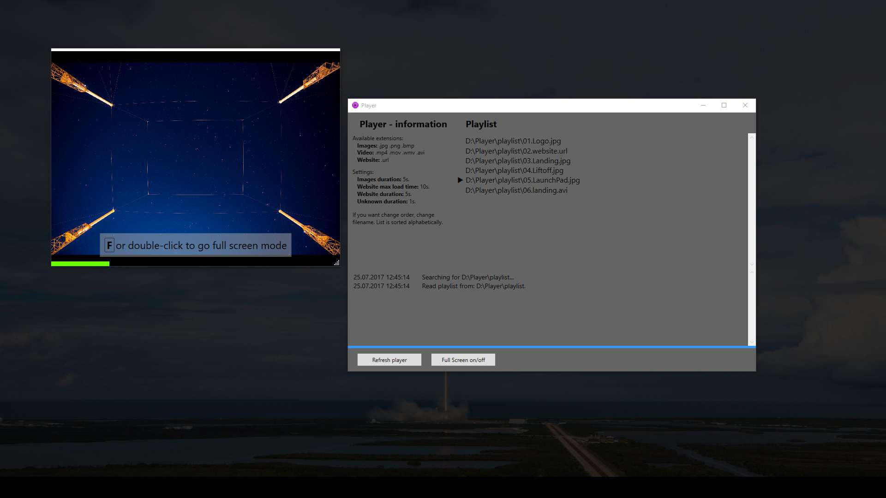

  

Program that allow changes between multimedia in loop: images / video / websites.  
Something like [Slidedog](https://slidedog.com/) but much much much worse :D

## Executable
Executable file can be found here [https://github.com/charJKL/player/releases/tag/v1.0](https://github.com/charJKL/player/releases/tag/v1.0).
In first use program will create "playlist" folder and "settings.txt" in current directory.

## Issues
To browser internet application involves WPF WebBrowser control, which isn't perfect. Most fancy websites may looks ugly, or not work at all.

## Printscreen

	
	

